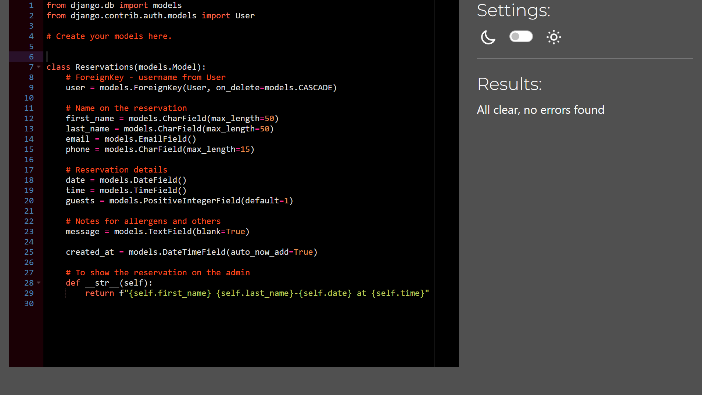

# Baiano Restaurant


## Table of Contents

- [Overview](#overview)
- [User Experience (UX)](#user-experience-ux)
  - [Strategy (Site Goals)](#strategy-site-goals)
  - [Scope (User Stories)](#scope-user-stories)
  - [Structure (Design Choices)](#structure-design-choices)
  - [Skeleton (Wireframes)](#skeleton-wireframes)
  - [Surface (Visual Design)](#surface-visual-design)
- [Technologies Used](#technologies-used)
  - [Languages](#languages)
  - [Libraries & Frameworks](#libraries--frameworks)
  - [Tools](#tools)
- [Deployment](#deployment)
- [Existing Features](#existing-features)
- [Future Features](#future-features)
- [Testing](#testing)
- [Bugs](#bugs)
- [Credits](#credits)

---

## Overview

The Baiano Restaurant is a fictional Brazilian restaurant, and the webpage was developed as a full-stack project for Code Institute Milestone 3. The webpage has a homepage introducing the restaurant, a menu page with its main dishes, and a login system that allows registered users to create, edit, and delete reservations.

Designed with a mobile-first approach, the website is fully responsive to ensure a consistent experience across all devices. It implements CRUD functionality, where registered users can manage their reservations, while the superuser can access the admin panel to oversee all bookings and make changes as needed.

[Back to the top](#table-of-contents)

## User Experience (UX)

Baiano Restaurant’s users are primarily people from Bahia, living abroad, and looking for Bahian food, often browsing on mobile while looking for a place to eat.

Customers want to quickly have a look at the menu with images, check opening hours, and book a table. Customers can manage existing reservations, while staff/admin users can review and update bookings. The experience should feel warm, vibrant, and reminiscent of home, and accessible for all users.

[Back to the top](#table-of-contents)

## Strategy (Site Goals)

The website aims to promote Baiano Restaurant by sharing authentic Bahian dishes, and creating a sense of home for people from Bahia living abroad.

It highlights the restaurant’s unique flavours and cultural background with pictures on the menu from the dishes made at the restaurant.

The webpage provides all essential information, such as menu, opening hours, and location, allowing customers to book tables online, by phone, or email.

A mobile-first design ensures that it looks and feels comfortable on all screen sizes.

For management, the admin area enables staff to review, edit, and organise reservations, helping the restaurant operate more efficiently.

[Back to the top](#table-of-contents)

## Scope (User Stories)

The project is organised and tracked on GitHub Projects, which can be viewed [here](https://github.com/users/faelf/projects/4).

The board displays all features categorised by their current status: To Do, In Progress, and Complete.

Each user story represents a feature or functionality for the website. They have been prioritised using the MoSCoW method (Must Have, Should Have, Could Have, Won’t Have), based on my current capabilities and future development goals. The project includes features I am currently able to develop, as well as others I plan to add in the future as I continue learning.

Below are the User Stories, with their acceptance criteria.

- [Restaurant Menu](https://github.com/faelf/baiano/issues/1)
- [Contact information and opening hours](https://github.com/faelf/baiano/issues/2)
- [Customer to make reservations online](https://github.com/faelf/baiano/issues/3)
- [Update menu items](https://github.com/faelf/baiano/issues/4)
- [Navigation to all pages](https://github.com/faelf/baiano/issues/5)
- [Contact form](https://github.com/faelf/baiano/issues/6)
- [Restaurant map location](https://github.com/faelf/baiano/issues/7)
- [Customer reviews](https://github.com/faelf/baiano/issues/8)
- [Social media links](https://github.com/faelf/baiano/issues/9)
- [Admin reviews management](https://github.com/faelf/baiano/issues/10)

[Back to the top](#table-of-contents)

## Structure (Design Choices)

### Entity Relationship Diagram (ERD)

The ERD below outlines the relationships between `User` and `Reservation` models.

<p align="center">
  
</p>

### Templates

A `base.html` template defines what is seen on every page, including the navigation bar and footer, with content injected via , so when the customer clicks on the `Menu` page, the `menu.html` page will extend the `base.html`. Ensuring consistancy across all pages.

### Static Files

Static files such as CSS, JavaScript, and images, are managed using Django’s  tag.

### Responsive Design

Bootstrap was chosen for its ease of creating a responsive design, and minimising the need for custom CSS media queries. Its column design makes it a simple way for the content on the page to adjust for various screen sizes, speeding up development and improving maintainability.

Images are set with `max-width` to ensure that they stay responsive, and they will not over grow and feel disproportional.

[Back to the top](#table-of-contents)

## Skeleton (Wireframes)

### Mobile


### Tablet


### Desktop


[Back to the top](#table-of-contents)

## Surface (Visual Design)

### Colour Palette

The colour palette is inspired by the vibrant culture of Bahia.

- **Primary Blue:** The main colour of the page, and the main colour from the flag of bahia, used on the navigation menu, footer, and main buttons.
- **Secondary Yellow:** A vibrat colour, to be used together with the primary colour.
- **Green:** Used on the `save` button.
- **Red:** Used on the `delete` button.
- **Light Tones:** For the background, that goes well with the primary colour.

### Typography

- **Logo:** [Amatic SC](https://fonts.google.com/specimen/Amatic+SC) - I chose Amatic SC for the logo because its handwritten style feels very Bahian.
- **Body Text:** [Nunito](https://fonts.google.com/specimen/Nunito) - I chose Nunito because it's a modern sans-serif font. Its rounded letters give it a friendly and welcoming look.

[Back to the top](#table-of-contents)

## Technologies Used

### Languages

- HTML
- CSS
- JavaScript
- Python

### Libraries & Frameworks

- [Bootstrap](https://getbootstrap.com/docs/5.2/)
- [Django](https://docs.djangoproject.com/en/5.2/topics/install/)
- [gunicorn](https://gunicorn.org/)
- [psycopg](https://pypi.org/project/psycopg2/)
- [dj-database-url](https://pypi.org/project/dj-database-url/)
- [whitenoise](https://whitenoise.readthedocs.io/en/stable/index.html)
- [django-allauth](https://django-allauth.readthedocs.io/en/latest/installation.html)

### Tools

- [Balsamiq](https://balsamiq.com/)
- [VS Code](https://code.visualstudio.com/)
- [Randomkeygen](https://randomkeygen.com/)
- [Coolors](https://coolors.co/)
- [Realfavicon](https://realfavicongenerator.net/)
- [Reduceimages](https://www.reduceimages.com/)

[Back to the top](#table-of-contents)

## Deployment

A step-by-step guide to deploying your Django project to Heroku on Windows.

### GitHub Setup

1. Create a new repository on GitHub.
2. Clone the repository to your local machine.

### VS Code Setup

1. Open the cloned repository in VS Code.
2. Create a virtual environment.
3. Install Django. `pip install django`
4. Create the project. `django-admin startproject (Project name) .`
5. Create an app. `python manage.py startapp (App name)`
6. Create a simple HttpResponse view for the homepage.
7. Install Gunicorn. `pip install gunicorn`
8. Create a `Procfile` with the command: `web: gunicorn (Project name).wsgi `
9. In settings.py add:

```python
WSGI_APPLICATION = '(Project name).wsgi.application'
```

10. Specify the Python version for your development environment using a `.python-version` file.
11. Add `heroku` and `localhost` to the `ALLOWED_HOSTS` in `settings.py`.

```python
ALLOWED_HOSTS = [
    '.herokuapp.com',
    'localhost',
    '127.0.0.1',
]
```

12. Create a database.
13. Create an `env.py` file and add the `DATABASE_URL` and `SECRET_KEY`.

```python
import os

os.environ.setdefault(
    "DATABASE_URL", "(Database URL)")

os.environ.setdefault("SECRET_KEY", "(Create a key)")
```

14. Install `psycopg2`. `pip install psycopg2`
15. Install `dj-database-url`. `pip install dj-database-url`
16. Add to `settings.py`.

```python
import os

import dj_database_url
if os.path.isfile('env.py'):
    import env

DATABASES = {
    'default': dj_database_url.parse(os.environ.get("DATABASE_URL"))
}
```

17. Run your first migration `python manage.py migrate`.
18. Create a superuser. `python manage.py createsuperuser`
19. Install `whitenoise` for static files. `pip install whitenoise`
20. Edit your `settings.py` file and add WhiteNoise to the `MIDDLEWARE list`, above all other middleware apart from `Django’s SecurityMiddleware`:

```python
MIDDLEWARE = [
    # ...
    "django.middleware.security.SecurityMiddleware",
    "whitenoise.middleware.WhiteNoiseMiddleware",
    # ...
]
```

21. Add the following to the bottom of your `settings.py` file:

```python
STATIC_ROOT = BASE_DIR / "staticfiles"
```

22. Run `collectstatic` to gather static files for production. `python manage.py collectstatic`
23. Create requirements file. `pip freeze > requirements.txt`
24. Commit all changes and push to GitHub.

### Heroku Deployment

1. Log in to the Heroku dashboard.
2. Click **New** and select **Create new app**.
3. Enter a unique app name.
4. Choose the deployment region.
5. In **Settings**, add all necessary config vars including:
   - Database URL
   - Secret key
6. Under **Deployment method**, connect the app to your GitHub repository.
7. Press **Deploy**
8. Test the deployed site thoroughly to ensure all features work as expected.

[Back to the top](#table-of-contents)

## Existing Features

### Navigation

- A responsive navigation bar is present on all pages, providing consistent access to all pages.
- **Dynamic Links:** The navigation bar dynamically adapts based on user authentication.
- **Authenticated Users:** See links for `My Bookings` and `Log out`.
  <p align="center">
    
  </p>
- **Unauthenticated Users:** See links for `Log in` and a `Register` button.
  <p align="center">
    
  </p>

### Homepage

The homepage introduces the restaurant, and at the same time being functional.

- **Hero Section:** A full-width hero image with a welcoming message and large buttons for the customer to easily book a table or register in the restaurant.
- **Popular Choices:** This section displays featured dishes with images and brief descriptions, giving users a quick taste of the menu.
- **Customer Reviews:** To create a connection between customers and the restaurant.
- **About Us:** This final section tells the story of the restaurant.

### Footer

- **Social Media:** Button links for the YouTube, Instagram, and Facebook.
- **Contact Information:** Phone number and email.
- **Location:** Address of the restaurant.
- **Opening Hours:** Hours of operation.

### Menu

A menu page with pictures of the dishes to attract customers.

### Login & Registration

These features provide the main functionality, and enable a personalised experience for each user by allowing them to manage their bookings and access user-specific content.

### Reservations

The `My Bookings` page is designed as a user page, where customers can view and manage their reservations, and feel it is their space on the webpage, implementing full CRUD functionality for managing reservations.

- **Read:** Users can view all their reservations in a card layout ordered by date.
- **Create:** The `New Booking` button allows users to easily make a new reservation.
- **Update:** Clicking `Edit` enables the `Save` and `Cancel` buttons, providing an intuitive editing experience.
- **Delete:** The `Delete` button redirects the customer to a confirmation page, where they can delete or keep their reservation.

  <p align="center">
    
  </p>

### Sucess Messages

- Feedback messages when the user logs in, logs out, register, create a reservation, edits a reservation, or deletes a reservation.
  <p align="center">
    
  </p>

### Progressive Web App (PWA)

- The website is an installable Progressive Web App (PWA), offering an app-like experience for quick and easy access. This allows users to launch the restaurant page directly from their home screen on both mobile and desktop devices.

<p align="center">
  
</p>

[Back to the top](#table-of-contents)

## Future Features

These are on the GitHub Project in the To Do.

- **Menu:** Admin can edit the menu, adding and removing items.
- **Contact Form:** A contact form that possible customers can ask questions.
- **Map:** Embedded Google Maps.
- **Customer Reviews:** A form where customers can leave reviews. And admins can display them on the page.
- **Front-end Admin Page:** An admin page on the webpage where the admin can edit reservations.

[Back to the top](#table-of-contents)

## Testing

### W3C - Markup Validation Service

First time running the test, I got a few typo error, double classes.

**Home Page**

<p align="center">
  
</p>

This was my code.

```HTML
<div class="col-12 col-md-4">
  </figure>
    <blockquote class="blockquote">
      <p>“A hidden gem in London! The atmosphere is cosy and the staff made us feel like family. Can not wait to try caruru next time.”</p>
    </blockquote>
    <figcaption class="blockquote-footer">Sofia R.</figcaption>
  </figure>
</div>
```

This was the fix.

```HTML
<div class="col-12 col-md-4">
  <figure>
    <blockquote class="blockquote">
      <p>“A hidden gem in London! The atmosphere is cosy and the staff made us feel like family. Can not wait to try the caruru next time.”</p>
    </blockquote>
    <figcaption class="blockquote-footer">Sofia R.</figcaption>
  </figure>
</div>
```

**Log in page**

<p align="center">
  
</p>

The `Submit` button had 2 `class="btn"`, so I fixed it.

**My Bookings**

<p align="center">
  
</p>

1. Double class, `card-title` was not needed, so I removed it.

```HTML
<p class="display-6 mb-3" class="card-title">Booking details</p>
```

2. The other errors was because it was missing the `id` attribute.

```HTML
<label for="message" class="form-label">Message</label>
<textarea id ="message" class="form-control" rows="4" readonly>{{ reservation.message }}</textarea>
```

**Delete Booking Page**

<p align="center">
  
</p>

1. The first error is due to the format given to the form, it should be `YYYY-MM-DD`.

```HTML
<input type="date" name="date" class="form-control" value="{{ object.date|date:'d/m/Y' }}" disabled>
```

Then I fixed it to

```HTML
<input id="date" type="date" name="date" class="form-control" value="{{ object.date|date:'Y-m-d' }}" disabled>
```

2. And the other errors were missing `id` attributes.

**Sign Out Page**

<p align="center">
  
</p>

One error, double class, and just removed `class="btn"`.

```HTML
<button class="btn btn-primary" type="submit" class="btn">Sign Out</button>
```

**No Errors:** After fixing all the errors, finally got no errors.

<p align="center">
  
</p>

### The W3C CSS Validation Service

<p align="center">
  
</p>

### JSLint

**First try:**

<p align="center">
  
</p>

1. To fix the if statement

```JavaScript
if (!editBtn) {
      return;
    }
```

2. To fix the 80 character

```JavaScript
const deleteUrl = card.querySelector("form").dataset.deleteUrl;
```

**Second try** After fixing the first errors, I got more errors when running again.

<p align="center">
  
</p>

This was how I fixed it, and because I got an error for the readonly false, I fixed for the true as well.

```JavaScript
inputs.forEach(function (i) {
        i.readOnly = false;
      });
```

**Third try** And then running again, I got another error.

<p align="center">
  
</p>

This is how I fixed it.

```JavaScript
window.alert("Delete URL not configured.");
```

**Fourth try:** Finally no errors.

<p align="center">
  
</p>

### PageSpeed

**Home Page**

- **Mobile:**
<p align="center">
  
</p>

- **Desktop:**
<p align="center">
  
</p>

**Menu Page**

- **Mobile:**
<p align="center">
  
</p>

- **Desktop:**
<p align="center">
  
</p>

For the errors below, I changed the secondary button text colour to black, and the navigation buttons, but decided to keep the social media buttons text white, as it looks better than with a black text, but removed the hover effect.

<p align="center">
  
</p>

### CI Python Linter

The only error I got was that some lines were longer than 80 characters, and they were easy to fix.

<p align="center">
  
</p>

<p align="center">
  
</p>

<p align="center">
  
</p>

<p align="center">
  
</p>

[Back to the top](#table-of-contents)

## Bugs

There is no known bugs yet.

[Back to the top](#table-of-contents)

## Credits

### Text

- The text on this webpage was created by [Gemini](https://gemini.google.com/).

### Code

- [Traversy Media - Python Django 7 Hour Course](https://www.youtube.com/watch?v=PtQiiknWUcI&list=LL&index=11) - Great crash course on Django.
- [Cory Schaffer - Python Django Tutorial](https://www.youtube.com/watch?v=UmljXZIypDc&list=PL-osiE80TeTtoQCKZ03TU5fNfx2UY6U4p) - Amazing YouTube tutorial on Django.
- [Kevin Powell](https://www.youtube.com/@KevinPowell) - Kevin's YouTube channel is focused on CSS, with amazing examples and short tutorials.

### Reference Pages

- [Bootstrap](https://getbootstrap.com/docs/5.2/)
- [Django](https://docs.djangoproject.com/en/5.2/topics/install/)

### Images

- **Menu:** The images were taken from the pages below
- Bobó de Camarão - https://www.sumerbol.com.br/uploads/images/2021/06/bobo-de-camarao-1134-1624568462.jpg
- Moqueca Baiana - https://foodandroad.com/wp-content/uploads/2021/06/img-brazil-moqueca-15-500x500.jpg
- Acarajé - https://assets.tastemadecdn.net/images/286b17/1231874d2fa30f09baa7/cce93d.jpg
- Abará - https://instadelivery-public.nyc3.cdn.digitaloceanspaces.com/itens/1701525573656b38459c900_75_75.jpeg
- Caruru - https://canaldareceita.com.br/wp-content/uploads/2025/03/CARURU-720x720.jpg
- Xinxim de Galinha - https://nacolher.com/wp-content/uploads/2022/10/como-fazer-xinxim-de-galinha.jpg
- Feijoada - https://th-thumbnailer.cdn-si-edu.com/6yQXolz5w833JwZEsjOWR2TJjiY=/1280x1280/https://tf-cmsv2-smithsonianmag-media.s3.amazonaws.com/filer/a2/af/a2af930e-aa90-412b-9ec8-b0de651d5fa7/feijoada-brazil-world-cup.jpg
- Pão de Queijo - https://static01.nyt.com/images/2024/12/19/multimedia/KF-Pao-de-Queijorex/KF-Pao-de-Queijorex-mediumSquareAt3X-v2.jpg
- Coxinha - https://www.beths.uk/cdn/shop/products/coxinha03_40cab723-f1ab-4310-9222-5356ae659e47_1445x.png?v=1719501444
- Pastel - https://thumbs.dreamstime.com/b/pastel-brasile%C3%B1o-de-la-comida-homemade-121303554.jpg
- Brigadeiro - https://bonnibakery.com/wp-content/uploads/2024/08/Brigadeiro_206-1.jpg
- Quindim - https://divaliciousrecipes.com/wp-content/uploads/2014/02/quindim.jpg
- **Others:** They were generated by Gemini.

[Back to the top](#table-of-contents)

```

```
